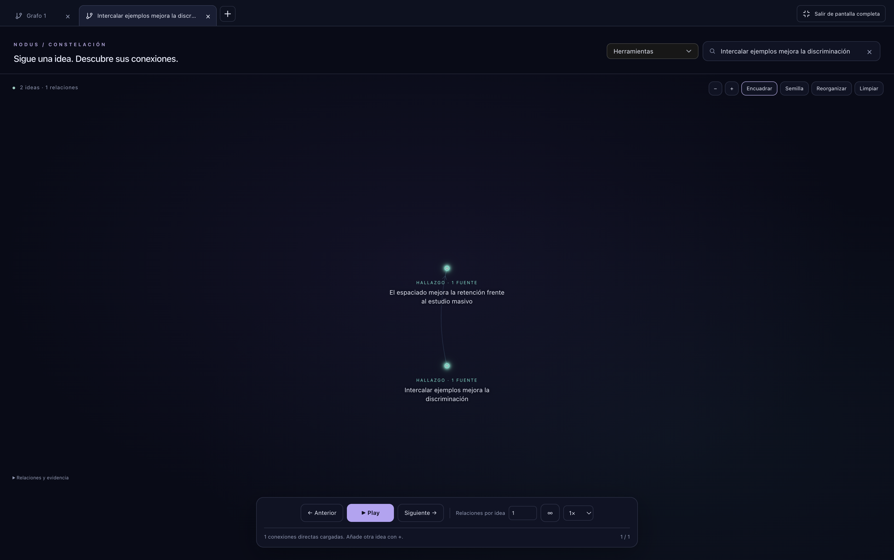
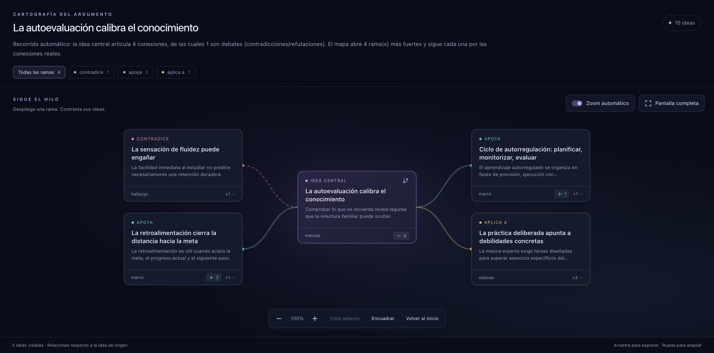

# Stellar research canvas

The idea graph uses one WebGL2 infinite canvas across the corpus, work view, Study, Immersion excerpts, and published Server Web spaces. Argument Map has its own card-based canvas; person and primary-source networks retain their specialized views.

## Following a research thread

The first visit in a new app session opens an empty graph. Search for an idea and choose it to load its direct incoming and outgoing relationships immediately, up to **Relations per idea** (25 by default). **Unlimited** loads the entire direct neighborhood, including hubs larger than one page. Work and Study graphs respect their source scope.

Use **+** beside a search result to add another idea and its direct connections. Every visible idea shows **−**, which removes only that idea and its incident connections; other ideas remain, including isolated ones. Removed ideas stay excluded from subsequent exploration until explicitly added again. **Clear**, beside **Reorganize**, empties the active canvas and cancels pending exploration. These actions never delete library records.

Use **+** in the tab strip to create another empty graph. Each tab keeps its own ideas, history, positions, camera, limit, and evidence panel while switching tabs. Returning from another section restores the open graphs during the current window session. A new app session starts empty. External idea navigation opens a separate tab without replacing existing graphs. **Full screen** enlarges the workspace; use its exit button or Escape to return.

**Next** and **Play** continue breadth-first exploration through stored relationships, prioritizing confirmed and explicit relationships where available. Incoming relationships retain their native arrows. Playback never generates AI relationships. The same limit controls the number of steps in a playback run; unlimited playback continues until the reachable component is exhausted.

**Previous** rewinds the exploration; **Next** replays existing history before discovering more relationships. Changing the starting idea retains the canvas and truncates any undone continuation.

Each playback step frames both endpoints above the controls, using a 550 ms camera transition. The current relationship, direction, and endpoint labels stand out against the dimmed context. Play advances immediately and leaves 3.5 seconds between steps at normal speed. Reduced-motion preferences disable the camera animation.

Dragging, zooming, Fit all, and Seed pause playback for manual exploration. Play, Previous, and Next automatically resume framing; no follow checkbox is required. Previous at the beginning centers the starting idea. View connection recenters the current relationship without advancing.

Clicking an idea or relationship opens its evidence detail and pauses playback. Resuming keeps that detail and its reading position open; the camera uses the remaining canvas width. The bottom bar continues to show the current relationship. The sidebar header sits outside the scrolling content, with an opaque background and 24 px of separation below it.

The header search supports pagination, arrow keys, Enter, Escape, and stale-request cancellation. Selected-idea actions live in the bottom bar. Source rings are optional, and the sidebar retains the full evidence list.

Connected components and isolated ideas receive a compact two-dimensional layout in a worker. Existing coordinates remain stable during exploration. Reorganize recalculates positions without changing topology or history.

## Data, persistence, and compatibility

- `exploration.ts` implements paginated traversal, cancellation, and reversible history.
- `stellarService.ts` queries eligible neighbors, complete works, and specific elements in pages of at most 200 relationships, without an implicit total cap.
- `source.ts` preserves the data scope of Study and Immersion.
- `StellarCanvas.tsx`, `presentation.ts`, and `gpu.ts` handle navigation, endpoint framing, labels, and rendering. Lower detail reduces label density and drawing cost without deleting stored relationships.
- Graph tabs use in-memory view snapshots containing identifiers and navigation state. Restoration revalidates identifiers and starts paused. Snapshots are isolated by vault and source scope and disappear when the window session ends. The pre-existing `stellar_sessions` table and API remain compatible, but this workspace no longer restores or writes those legacy sessions. No new migration is required.
- Published Web endpoints remain behind the existing space authorization boundary. Open graph tabs remain in browser memory under the active space and are not written to the legacy IndexedDB sessions. The published corpus is read-only.

The previous Sigma idea renderer, thematic atlas, Louvain supernodes, and overview/backbone endpoints are removed. Topology services used by research, tutoring, and analysis remain available.

A stored relationship is not a validated claim. Dashed lines distinguish inferred relationships; the detail panel exposes available provenance, direction, rationale, evidence, and review controls. Breadth-first exploration is a topological itinerary, not a logical proof.

## Visual argument maps

Argument Map offers **Visual map** and **Outline** views over the same generated map. The visual view displays the central idea, typed branches, expandable cards, and the selected path to its parent and children. Relation filters and card expansion only change what is drawn; they do not create or alter relationships.

Selecting a card opens its evidence and, with **Auto zoom** enabled, focuses it and nearby relations at a readable scale. Disable that switch to keep manual camera control. **Previous view** restores the preceding camera without collapsing branches; zoom out manually or use **Fit all** to return to the overview. Dragging and double-clicking the canvas do not select text, while source excerpts remain selectable.

Full screen gives the map and evidence panel the entire workspace. Both themes, reduced-motion preferences, and all eight supported interface languages are supported. The auto-zoom preference is stored locally.

## Validation

Run `npm test` for traversal, pagination, cancellation, complete works, stable placement, session boundaries, and camera geometry. `npm run test:e2e:stellar` exercises the real application with an isolated demonstration profile, including search, playback, framing, rewind, empty startup, and sidebar behavior. `npm run test:e2e:stellar-tabs` covers additive search, removal, independent tabs, view snapshots, and full screen. `npm run test:e2e:argument-map` covers visual branches, filters, camera history, auto zoom, text selection, and full screen. All three use isolated demonstration profiles. The normal repository lint, builds, and E2E smoke also apply.

Local review copies can use `NODUS_USERDATA` with `NODUS_STELLAR_PREVIEW=1` to skip startup background integrations. QA uses the existing database-path guard. Profiles, copied vault content, reports, and recordings are local artifacts and are not distributed with the source.
